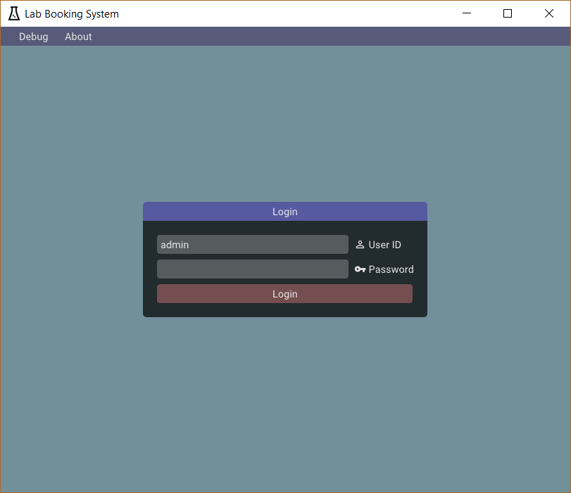
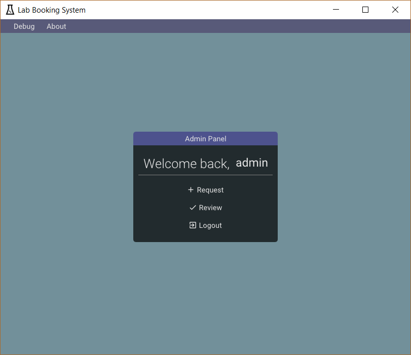
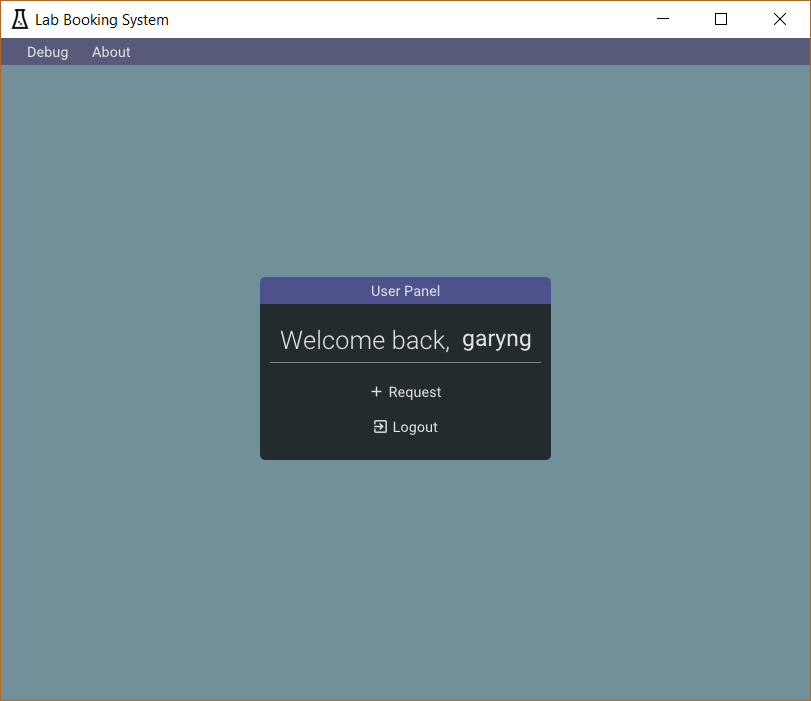
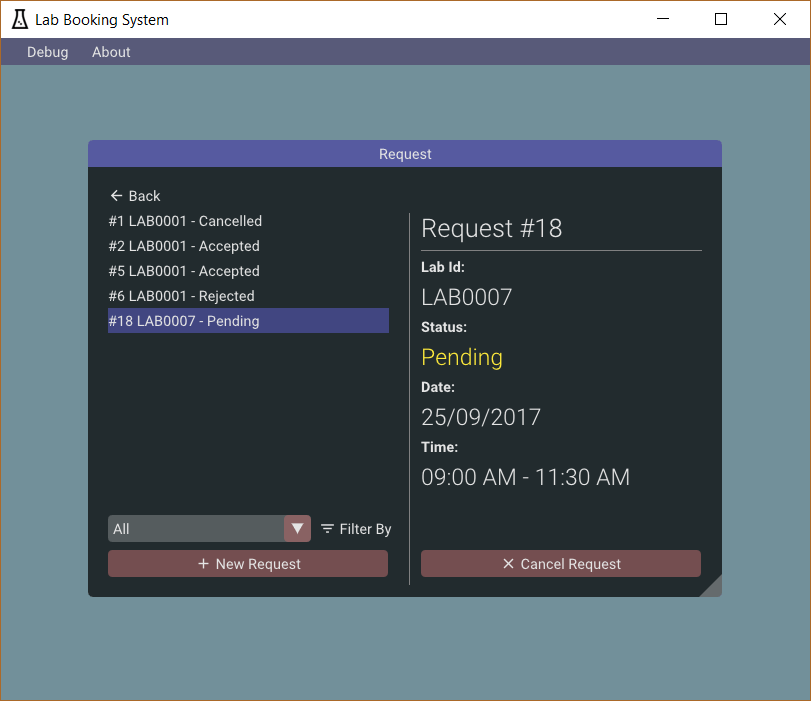
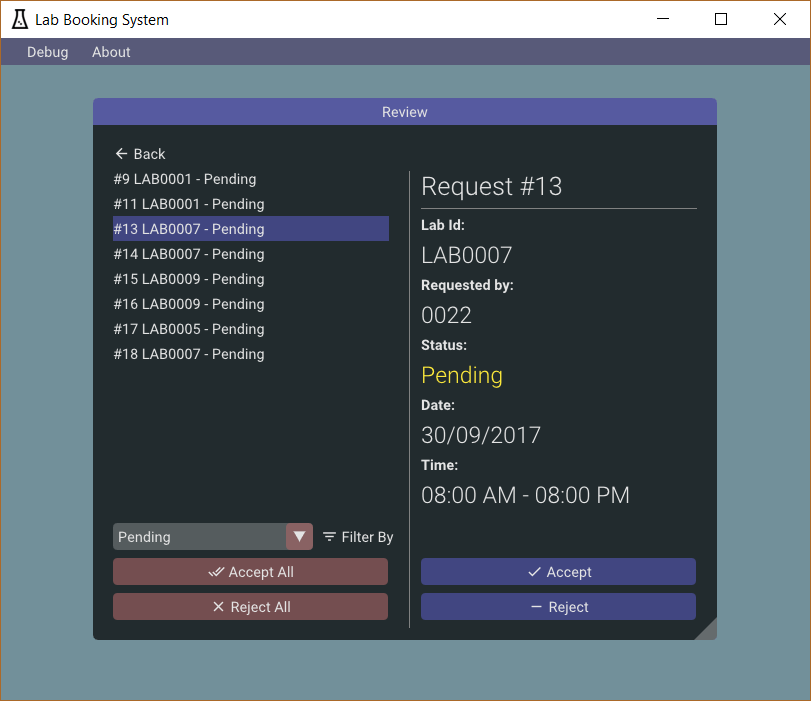

# Lab Booking System
A simple lab booking system implemented in C++.

# Building
The `Visual Studio 2017` project file is located under `src/`. Open it with Visual Studio and build with either `Debug-Static` or `Release-Static` configuration. The compiled binaries, along with some others files will be copied to the `bin/` folder.

# Libraries
[ImGui](https://github.com/ocornut/imgui): Bloat-free Immediate Mode Graphical User interface for C++ with minimal dependencies 

[json](https://github.com/nlohmann/json): JSON for Modern C++

[Poco](https://pocoproject.org/): Modern, powerful open source C++ class libraries for building network- and internet-based applications that run on desktop, server, mobile and embedded systems. 

[linq](https://github.com/coveo/linq): Port of .NET LINQ operators in C++ 

[PicoSHA2](https://github.com/okdshin/PicoSHA2): a header-file-only, SHA256 hash generator in C++ 

[better-enums](https://github.com/aantron/better-enums): Compile-time enum to string, iteration, in a single header file.

[IconFontCppHeaders](https://github.com/juliettef/IconFontCppHeaders): C, C++ and None headers for icon fonts Font Awesome, Material Design and Kenney game icons 

# Screenshots
## Login

## Admin Panel

## User Panel

## Request

## Lab Selection

## Time Selection

## Review

# Others
This is a project made for my `TCP1121 Computer Programming` subject.

# Credits
## Icons

Flask by Ralf Schmitzer from the Noun Project